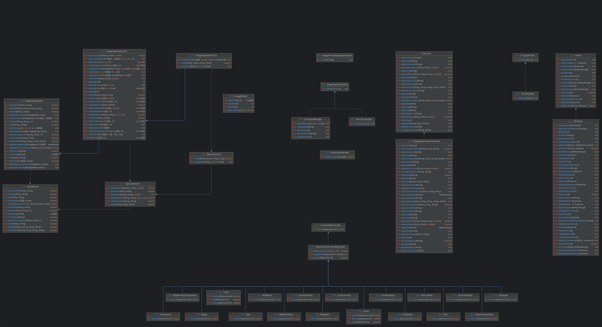

Image Processing Application
===


## Overview


This Java-based image processing application is designed using the Model-View-Controller (MVC) design pattern.
The system implements various design patterns, enabling adaptable and dynamic processing of user commands.
It empowers users to perform a variety of image manipulation operations, including:


- **Getting individual channel**
- **Getting various brightness components**
- **Brightening**
- **Darkening**
- **Blurring**
- **Sepia transformation**
- **Sharpening**
- **Flipping**
- **Splitting RGB components**
- **Combining RGB components**
- **Compressing**
- **Histogram**
- **Color Correction**
- **Levels Adjustment**
- **Split Preview**
- **Downscaling**
- **Partial Image Manipulation**

## Key Components

- **Controller**: The main component responsible for interpreting user input and directing commands as needed.
- **Model**: Handles the execution of image-related operations.
- **View** : Manages the user interface (UI) and displaying data to the user. It is responsible for presenting the data in a user-friendly format, and it listens for user interactions, passing input to the Controller for further processing.
- **Commands**: Each command performs a specific image manipulation task, such as brightening, blurring, saving, or flipping.
- **Execution**: The interface and its corresponding implementation that initiates and manages the program flow.

# Table of Contents

1. [Project Structure](#project-structure)
    - [Class Description](#class-description)
    - [Class Diagram](#class-diagram)
    - [Image Format Conversion](#image-format-conversion)
    - [Multi-image Processing](#multi-image-processing)
2. [User Input and Command Script ](#user-input-and-command-script)
    - [Error Handling](#error-handling)
    - [Installation](#installation)
3. [Run Application](#run-application)
    - [Prerequisited](#prerequisites)
    - [Running Jar File](#running-the-jar-file)
    - [Running ImageProcessingApplication Class](#running-the-imageprocessingapplication-class)
4. [Design Changes and Justification](#design-changes-and-justification)
    
5. [Citation of the images](#citations-of-images-used-for-testing)
    
# Project Structure

---

- **model/**: Contains classes representing the data and logic of the application.
    - `ImageModel.java`: Manages image metadata and pixel data.
    - `Operations.java`: Interface which defined the various operations to be performed.
    - `OperationsV2.java`:
      This updated Operations interface, extending the previous version, introduces new methods for the ImageProcessingProgram.
    - `ImageOperations.java`: Class that implements the Operations interface. Contains methods for various image processing operations.
    - `ImageOperationsV2.java` : This class extends the previous version, implementing the OperationsV2 interface with new methods: compression, histogramVisualization, colorCorrection, levelsAdjustment, and splitPreview.
    - `OperationsV3.java` : This is the newly updated interface with extends the OperationV2` and introduces two new method one for partial image manipulation and one for the DownScaling for the ImageProcessingProgram.
    - `ImageOperationsV3.java` : This class extends the ImageOperationV2 class and implements the OperationsV3 interface and provides concrete implementation for the new methods.
  


- **controller/**: Contains the main logic files for handling commands and scripting for the package, as well as the classes for each and every command.
    - `ImageAppController.java` : Interface which defines the start operation, which needs to be carried out by Controller.
    - `CommandReader.java` : Reads and interprets script files  also manages the single line command provided for command execution and implements the ImageAppController. This has a startApplication function which basically starts the application. Also, this parse the input
      commands and gives the filter command to the CommandHandler class
    - `CommandHandler.java` : This class has a takes the parsed commands from CommandReader, and using the map redirect the command to the appropriate class design to handle the specified command.
    - `CommandExecuter.java`: Interface which defines the method need to be implemented by each command.
    - `AbstractCommandExecuter.java` : Abstract class to implement the command method between all command classes. All command Classes in the package extends this class. Contains
      implementation of common method of various command classes. This class implement the CommandExecuter interface.
    - `Blur.java`: Redirects the controller to the blur implementation in Model. Also checks if the command provided is correct or not. If not throws error.
    - `Brighten.java`: Redirects the controller to the brighten implementation in Model. Also checks if the command provided is correct or not. If not throws error.
    - `BrightnessComponent.java`: Redirect the controller to the getBrightnessComponent in Model. Also
      passes the appropriate handler based on input. The handler can be value, luma, or intensity. Value component is calculated by taking the max of the rgb values at each point and replace the max value in all channel at that point.
      Luma component is calculated by taking the weighted average of the rgb values at each point and replace the value in all channel at that point.
      Intensity component is calculated by taking the average of the rgb values at each point and replace the value in all channel at that point.
    - `ColorComponent.java`: Redirect the controller to the getColorComponent in Model. Also
      passes the appropriate color based on input. The handler can be 0,1 or 2 which are
      red, green or blue.
    - `HorizontalFlip.java`: Redirect the controller to the horizontalFlip implementation in Model. Check if the command is correct or not.
    -  `VerticalFlip.java` : Redirect the controller to the horizontalFlip implementation in Model. Check if the command is correct or not.
    - `Sepia.java` : Redirect the controller to the sepia implementation in Model. Check if the command is correct or not.
    -  `Sharpen.java` : Redirect the controller to the sharpen implementation in the Model. Check if the command is correct or not.
    -  `RBGCombine.java` : Redirect the controller to the rgbCombine implementation in Model. Check if the command is correct or not.
    -  `RBGSplit.java` : Redirect the controller to the rgbSplit implementation in Model. Check if the command is correct or not.
    -  `ColorCorrect.java` : Redirect the controller to the colorCorrection implementation in Model. Check if the command is correct or not.
    -  `LevelsAdjust.java` : Redirect the controller to the levelAdjustment implementation in Model. Check if the command is correct or not.
    -  `Histogram.java` : Redirect the controller to the histogram implementation in Model. Check if the command is correct or not.
    -  `Compress.java` : Redirect the controller to the compressImage implementation in Model. Check if the command is correct or not.
    - `Save.java`: The class obtains the matrix representation of image from Model. On the basis of the extension of the image which is to be saves the image gets saved at suitable filepath.
    - `Load.java `: The class converts any input format to a three dimension matrix to be passed to the Model.
    - `Quit.java `:  A class that performs the Quit operation. So when the user provides the quit command the program terminated.
    - `DownScaling.java`: Redirect the controller to the downscale implementation in Model with the required parameter. Check if the command is correct or not.
    - `Features.java`: This interface serves as the foundation for core GUI-based operations, facilitating seamless image processing and efficient user interaction. It provides intuitive controls and interactive features, enabling users to load, manipulate, and save images effortlessly while ensuring a smooth and responsive experience. Through this interface, users can apply various image processing techniques, preview changes in real-time, and manage their workflow with ease, all within a user-friendly graphical environment.
    - `ImageApplicationFeatures.java`: The ImageApplicationFeatures class implements the Features interface, providing the core logic for handling image processing operations. This class interacts with the CommandHandler to process user commands and with the OperationsV3 model for performing image manipulation tasks.

  - `MVCController.java`: Constructs an MVCController that links the specified model and view, and initializes the features that handle the interaction between them.

- **view/**: View plays a crucial role in managing the user interface (UI) and displaying data to the user. It is responsible for presenting the data provided by the Controller through the Model in a user-friendly format, and it listens for user interactions, passing input to the Controller for further processing.
    - `ProgramView.java` : Interface for the view of this ImageProcessingProgram. It defines the setOutput method to display the output.
    - `ViewHandler.java` : This class implements the ProgramView interface and has an Appendable object to show the output of the program.
    - `IView.java`: The interface is representation for the view component in the image processing application. This interface defines methods for interacting with the user interface, displaying images, showing error messages, and facilitating communication between the view and the controller through GUI
    - `GuiView.java`: The GuiView class implements the IView interface and serves as the main graphical user interface for the image processing application.
  
- **ImageProcessingApplication**: The entry point of the application. This is the main class where the controller and model objects are instantiated, and from here the controller starts to take the user input.


## Class Description

---

The application is based on MVC architecture
- **model** :  This package contains all the classes which are needed to manipulate and store metadata associated with each image.
    1. `Operations.java` : This interface represents the contract which defines the operations that can be performed on images, regardless of their specific types. The                     available methods include: retrieving components, flipping, brightening, splitting, combining, blurring, sharpening, and applying sepia filtering.

    2. `ImageOperations.java` : The ImageOperations class implements the Operations interface, providing implementations for various image manipulation and processing tasks. This class also maintains a map that stores instances of all images loaded and processed during the execution of the application, allowing efficient access and manipulation throughout the script's runtime.

    3. `ImageModel.java` : This class represents an image, so the class contains all the variables and method needed to handle an image. An image is a 3-d matrix of pixels.
    
    4. `OperationsV2.java` : New version of the operations interface that introduces new methods provided by the ImageProcessingProgram. It extends the older version Operations interface.
    
    5. `ImageOperationsV2.java` : This class implements the new methods needed to be implemented by the program. It extends the older class and implements the new OperationsV2 interface. It introduces the following new methods Compression,Histogram Visualization,Color Correction,Levels Adjustment,Split Preview.
    
    6. `OperationsV3.java` : The OperationsV3 interface extends OperationsV2 and adds new  methods for advanced image processing tasks. These include: Masking an image based on a mask image and a temporary image and Downscaling an image to specified dimensions using interpolation.
  
    7. `ImageOperationsV3.java` : This class implements the new methods needed to be implemented by the program. It extends the older class ImageOperationV2 and implements the new OperationsV3 interface. It introduces the following new methods Masking of image and DownScaling of image.
    

- **controller** : This package contains all the classes which are needed to have a communication between model and view and is responsible for the I/O operations for the application.
    1. `CommandReader.java` : The CommandReader class is responsible for reading and executing commands from a script file as well as the ones provided in command line. It utilizes a CommandHandler to  process commands parsed from the file/command-line. This class provides methods to read commands from a specified file path, ensuring that the file is in the correct format and skips comments.

    2. `ImageAppController.java` : This is an interface which defines a method for processing commands. Implementing classes should provide the logic to handle the command input       into the system.

    3. `CommandHandler.java` : The CommandHandler class is responsible for managing various commands related to image processing. It utilizes a HashMap to associate command strings with their respective command classes, allowing for the dynamic creation of command objects using BiFunction.

    4. `CommandExecuter.java`: Interface which defines the method ( execute() ) to be implemented by each command. Other classes such as Load, Save, Brighten etc. in the package implement this interface.

    5. `AbstractCommandExecuter.java` : Abstract class to implement the common methods between all command classes. All Classes in the package extends this class.
    
    6. `Feature.java` : The interface defines key image manipulation operations for the application, such as loading, saving, applying effects, and adjusting properties like brightness and compression. Implementing classes provide the logic for these operations, which the GUI invokes based on user input. This approach ensures consistency in image processing while keeping the GUI logic encapsulated within the appropriate classes.
    
    7. `ImageApplicationFeatures.java` : The ImageApplicationFeatures class implements the Features interface, handling image processing logic by interacting with the CommandHandler for user commands and the OperationsV3 model for image manipulation. It uses IView to communicate with the user interface, coordinating the model and view, processing commands, and updating the view accordingly.

    8. `MVCController.java` : The MVCController class initializes the features in the Model-View-Controller (MVC) architecture by connecting the model and view. It creates the feature instances, adds them to the view, and sets up their interaction.


- **view** :
    
    1. `ProgramView.java` : Interface for the view of this ImageProcessingProgram. It defines the setOutput method to display the output.
  
    2. `ViewHandler.java` : This class implements the ProgramView interface and has an Appendable object to show the output of the program.

    3. `IView.java` : The interface represents the view component in the image processing application. It defines methods for interacting with the user interface, displaying images, showing error messages, and enabling communication between the view and the controller through the GUI.
    
    4. `GuiView.java` : The GuiView class implements the IView interface and serves as the main graphical user interface for the image processing application. It manages the layout and functionality of the GUI, including buttons for operations like blur, sepia, sharpening, and brightness adjustment. This class handles user input, displays results, and interacts with the image processing features of the application. 
  
## Class Diagram
Below is the class diagram of the application generated using the IntelliJ-IDE.



## Image Format Conversion


In addition to standard image manipulation, the application supports interconversion between different image formats, enabling users to easily convert images from one format to another.

## Multi-Image Processing


The application can handle multiple images simultaneously, allowing users to load and process various images in one session.


User Input and Command Script
===

---
The user has two modes to use this application, either in interactive mode or in non-interactive mode
and also through the Graphical User Interface.

### Non-Interactive Mode

In non-interactive mode, the user can directly provide a filepath of the script and using the following command, the application runs that script and automatically quits.
```
-file name-of-script.txt
```

### Interactive Mode
Users interact with the application by providing a script file that specifies a sequence of commands also user can provide the command in a single line through the command prompt. Each command must detail:

1. The operation to be performed on the image.
2. The path to the image file (supported formats: JPEG, PNG, and PPM (P-3)).
3. The name for the new image that will be generated as a result of the operation.

If the command provided is invalid or not found a suitable message would be provided to the user. The program only terminates when the user provides a quit command.

The structure of various commands is as follows:

1. **load image-path image-name**: Load an image from the specified path and refer it to henceforth in the program by the given image name.
2. **save image-path image-name**: Save the image with the given name to the specified path which should include the name of the file.
3. **red-component image-name dest-image-name**: Create an image with the red-component of the image with the given name.
4. **green-component image-name dest-image-name**: Create an image with the green-component of the image with the given name.
5. **blue-component image-name dest-image-name**: Create an image with the blue-component of the image with the given name.
6. **intensity-component image-name dest-image-name**: Create an image with the intensity-component of the image with the given name.
7. **value-component image-name dest-image-name**: Create an image with the value-component of the image with the given name.
8. **luma-component image-name dest-image-name**: Create an image with the luma-component of the image with the given name.
9. **horizontal-flip image-name dest-image-name**: Flip an image horizontally to create a new image, referred to henceforth by the given destination name.
10. **vertical-flip image-name dest-image-name**: Flip an image vertically to create a new image, referred to henceforth by the given destination name.
11. **brighten increment image-name dest-image-name**: brighten the image by the given increment to create a new image, referred to henceforth by the given destination name. The increment may be positive (brightening) or negative (darkening).
12. **rgb-split image-name dest-image-name-red dest-image-name-green dest-image-name-blue**: split the given image into three images containing its red, green and blue components respectively. These would be the same images that would be individually produced with the red-component, green-component and blue-component commands.
13. **rgb-combine image-name red-image green-image blue-image**: Combine the three images that are individually red, green and blue into a single image that gets its red, green and blue components from the three images respectively.
14. **blur image-name dest-image-name**: blur the given image and store the result in another image with the given name.
15. **sharpen image-name dest-image-name**: sharpen the given image and store the result in another image with the given name.
16. **sepia image-name dest-image-name**: produce a sepia-toned version of the given image and store the result in another image with the given name.
17. **compress percentage image-name dest-image-name**: compresses the specified image by the given percentage. The quality of the image may decrease as the compression percentage increases.
18. **histogram image-name dest-image-name**: This command generates a histogram for the given image. A histogram is a graph that represents the distribution of pixel intensities in the image, typically across color channels (red, green, blue) or brightness levels.
19. **color-correct image-name dest-image-name**: This command applies color correction to the specified image. Color correction adjusts the color balance to improve the appearance of an image, correcting issues such as underexposure, incorrect white balance, or color casting.
20. **levels-adjust b m w image-name dest-image-name**: his command adjusts the brightness levels in the specified image using the black, mid, and white values (b, m, and w). These values help define the darkest (black), midtone (gray), and lightest (white) parts of the image, effectively adjusting contrast and brightness.
21. **quit** : command by which the user can end the application.
    
### Split Preview Commands

Following functionalities can also be viewed in split, that is a part of the image is manipulated and the other remains the same.
The syntax for its command is the user can just add "split p" after each of the commands.

For example:

**blur image-name dest-image-name split value**

Following are the list of commands that support split preview:
- **blur image-name dest-image-name split value**
- **sharpen image-name dest-image-name value**
- **sepia image-name dest-image-name value**
- **red-component image-name dest-image-name value**
- **green-component image-name dest-image-name value**
- **green-component image-name dest-image-name value**
- **blue-component image-name dest-image-name value**
- **value-component image-name dest-image-name value**
- **luma-component image-name dest-image-name value**
- **intensity-component image-name dest-image-name value**
- **color-correct image-name dest-image-name value**
- **levels-adjust b m w image-name dest-image-name value**


The application also allows users to specify the directory where the processed images will be saved.

### Run Script 

User can also have a text file which can contain combinations of all the above mentioned commands and 
can directly run this script file.

Command to run the script file with all the above-mentioned commands is:

**run script-file**: Load and run the script commands in the specified file.

**Note:** Whenever the user provides the load, run or save command, the user must specify the absolute file path from where the image is to be read or stored or from where the script file is present. If the path provided 
is not a valid one then an error is thrown.

### Partial Image Manipulations

This application supports applying image manipulations to specific regions of an image using a mask image (MI). A mask image is a black-and-white image of the same dimensions as the original image.

where: Black pixels in MI indicate regions where the manipulation will be applied in
and White pixels in MI preserve the corresponding pixels in  I without any changes.

This feature allows for advanced image processing capabilities, such as applying effects (e.g., blur, sepia, sharpen) selectively to parts of an image.


In our implementation, the operation is performed by first creating a temporary image where the selected operation is applied to the entire original image. 
This temporary image holds the processed pixel values resulting from the operation. 
Next, the mask method in the ImageOperationsV3 class is called with three inputs:
the temporary image, the original image, and the mask image.

The final image is then generated by combining these inputs based on the mask. 
For pixels in the mask image that are black, the corresponding pixel values from the temporary image are used in the final output.
Conversely, for pixels in the white regions of the mask, the pixel values from the original image are retained. 
This process ensures that the operation is applied selectively to the regions specified by the mask.

Following are the list of commands that support partial image manipulation:
- **blur image-name mask-image-name dest-image-name**
- **sharpen image-name mask-image-name dest-image-name**
- **sepia image-name mask-image-name dest-image-name**
- **red-component image-name mask-image-name dest-image-name**
- **green-component image-name mask-image-name dest-image-name**
- **blue-component image-name mask-image-name dest-image-name**
- **value-component image-name mask-image-name dest-image-name**
- **luma-component image-name mask-image-name dest-image-name**
- **intensity-component image-name mask-image-name dest-image-name**


Error Handling
--------------
---
The system has robust error handling, throwing appropriate exceptions for:

- Invalid command inputs.
- Non-existent files or directories.
- Incorrect image formats or unsupported extensions.
- Invalid parameter count for commands.


Image Format Support
--------------------
---
The application supports the following image formats:

- **PPM**: Portable Pixmap Format.
- **JPG / JPEG**: Joint Photographic Experts Group format.
- **PNG**: Portable Network Graphics.

Note: PPM images are saved in the plain text format (P3).


Installation
--------------------
---
1. Clone the repository:
   ```bash
   git clone https://github.khoury.northeastern.edu/aryanshah295/Assignment-4/
   ```
2. Navigate to the project directory:
   ```
   cd repository
   ```


# Run Application

---

The user can run this application either via the command line or by using a script file or throught the graphical user interface. Below are the steps for each method.

The user can either:
1. Run the main class, `ImageProcessingApplication`, directly.
2. Run the provided `.jar` file located in the `res` folder.

 Prerequisites
--------------------
Before running the application, ensure:
- The **Java Development Kit (JDK)** is installed on your system. You can verify this by entering the following command in your terminal or command prompt:

    ```bash
    java -version
    ```

Running the JAR File
--------------------

### Running GUI using JAR file

1. **Navigate to the Project Directory**  
   Move to the root project directory (e.g., `Assignment-6`) containing the `src`, `test`, and `res` folders:

    ```
    cd path/to/Assignment-6
    ```

2. **Run the application**  
   To start the application in GUI, use the following command:

    ```
    java -jar res/Assignment-4-MVC.jar
    ```

   After executing the command a GUI based interface will open and user can interact with the program 
   through the GUI.

**NOTE :** For successfully execution of the jar file ensure that the terminal is opened from the root project Directory (in this case Assignment-6).

### Running Interactive-Mode using JAR file

1. **Navigate to the Project Directory**  
   Move to the root project directory (e.g., `Assignment-6`) containing the `src`, `test`, and `res` folders:

    ```
    cd path/to/Assignment-6
    ```

2. **Run the application**  
   To start the application in interactive mode, use the following command:

    ```
    java -jar res/Assignment-4-MVC.jar -text
    ```

   After executing the command a CLI based interaction will open with the "Enter the command" text. Now user can 
   enter the command supported by the operation and can interact with the application. 

**NOTE :** For successfully execution of the jar file ensure that the terminal is opened from the root project Directory (in this case Assignment-6).

### Running Non-Interactive-Mode using JAR file

1. **Navigate to the Project Directory**  
   Move to the root project directory (e.g., `Assignment-6`) containing the `src`, `test`, and `res` folders:

    ```
    cd path/to/Assignment-6
    ```

2. **Run the application**  
   To start the application in interactive mode, use the following command:

    ```
    java -jar res/Assignment-4-MVC.jar -file path/to/scipt-file.txt
    ```
   For example:
    ```
    java -jar res/Assignment-4-MVC.jar -file res/script.txt
   ```    

   In our case we have kept the script.txt file in the res folder.

   After executing this command all the commands present in the script-file.txt will get executed and after all commands are done the program will terminate.

**NOTE :** For successfully execution of the jar file ensure that the terminal is opened from the root project Directory (in this case Assignment-6).


Running the ImageProcessingApplication Class
--------------------
---
1. **Navigate to the Project Directory**  
   Move to the root project directory:

    ```
    cd path/to/Assignment-6
    ```

2. **Compile the Java Files**  
   Compile all Java files with the following command:

    ```
    javac src/controller/*.java src/model/*.java src/view/*.java
    ```

3. **Running GUI based Applicaiton**
   After the first two steps are done now to run the application in GUI based mode 
   enter the below command.
    
    ```
    java -cp src controller/ImageUtil
   ```


4. **Running in Non-Interactive Mode**  
   After the first two steps are done now to run the application in non-interactive based mode
   enter the below command and provide a script file as an argument to run in non-interactive mode:

    ```
    java -cp src controller/ImageUtil -file res/script.txt
    ```

5. **Running in Interactive Mode**  
   After the first two steps are done now to run the application in interactive based mode
   enter the below command :

    ```
    java -cp src controller/ImageUtil -text
    ```

Now, you can follow the on-screen instructions to operate the application.


## Command Line Interface

1. Load an image:
```
load path/to/image.jpg input-image
```
Example: 
```
load images/manhattan-small.png man
```

2. Apply operations as needed.
Example:
```
blur man man-edited
```

3. Save the processed image:
```
save path/to/output.png output-image
```
Example: 
```
save res/man-edited.png man-edited
```

4. To terminate the program provide "quit":
```
quit
 ```
### Script Execution

1. Create a text file containing commands (e.g., `script.txt`)

2. Run `src/ImageProcessingApplication.java` file. The program will start and wait for user input.

3. Execute the script:


```
run script.txt
```
(NOTE: provide the absolute path of where script.txt is located in your system.)
Example: 
```
run D:/PDP/Assignment4/scripts/script.txt
```
**Note:** this command will only be executed in interactive mode.


# Design Changes and Justification

---

In the third phase of development for our Java-based image processing application, we expanded its 
functionality to support additional image operations, such as downscaling and partial image manipulation.
To accommodate these new features while preserving the 
existing design, we introduced modifications based on the MVC architecture and principles of extensibility.

In addition to introducing new operations within the application, we have also implemented a new method of interaction, 
allowing users to engage with the application through an intuitive graphical user interface (GUI).
This enhancement provides a more user-friendly experience. he GUI not only simplifies interactions but 
also offers a more efficient and enjoyable way for users to access the application's full range of features and capabilities.

Changes in Model
---

Extended Operations Interface:
--------------------
1. We developed a new interface, OperationsV3, which builds upon the existing OperationsV2 interface, leveraging the principle of code reuse.
2. This extension enables us to introduce new method definitions needed for additional image processing tasks, without modifying the original OperationsV2 interface.
3. By creating OperationsV3 as an extension, we maintain backward compatibility with the current interface, ensuring that future operations can be integrated smoothly with the original implementation.


New ImageOperationsV3 Class:
--------------------
1. We introduced ImageOperationsV3, a new concrete class that implements the OperationsV3 interface and enhances the capabilities of the existing ImageOperationsV2 class.
2. Through its extension of ImageOperationsV2, the new class inherits all previously defined operations (such as blur, sharpen, sepia filter, compression, histogram, etc.) while adding support for new operations like masking and downscaling.
3. By consolidating the new operations in ImageOperationsV3, we streamline the image manipulation process, making the codebase easier to maintain, test, and expand in the future.

Justification for Extending Rather Than Modifying Existing Code:
--------------------
- This design ensures that our initial implementation remains stable and untouched, reducing the risk of introducing bugs to existing features.
- Any modules or components relying on ImageOperations or Operations remain unaffected, maintaining compatibility with previously developed parts of the application.
- Adopting this approach also aligns with the Open-Closed Principle, allowing our system to be extended with new functionality without modifying existing code.
- This structured approach to adding new features not only safeguards the original design but also provides a robust and extensible framework for future enhancements.


Changes in Controller
--------------------


In this phase, we modified the controller to support the new image operations introduced in `ImageOperationsV3`. Instead of initializing an `ImageOperationsV2` object, we now initialize an `ImageOperationsV3` object and reference it through the `OperationsV3` interface. This allows the controller to seamlessly access both the existing and newly added functionalities.

1. **Updated Initialization**:
   - The controller now initializes `ImageOperationsV3` instead of `ImageOperationsV2`. This update provides access to all original methods from `ImageOperationsV2` as well as the new operations implemented in `ImageOperationsV3`.
   - By referencing `ImageOperationsV3` through the `OperationsV3` interface, the controller maintains flexibility, enabling straightforward access to the extended set of operations without modifying the core controller logic.

2. **Consistency and Extensibility**:
   - Refactoring to use `OperationsV3` throughout the controller ensures that the application is prepared to handle any future extensions to image processing operations without requiring further changes to the controller.
   - This approach keeps the controller code consistent and makes it extensible, allowing for additional operations to be incorporated with minimal impact on the existing codebase.
   - Also as now new operations are to be supported to in the commandMap in the CommandHandler new key-value pairs are added for compress, histogram, levels-adjust and color-correct and their respective command-classes are added
     to the controller.
   
3. **Adding new Command Design Class for Downscaling**:
    - Now as a new command is to be supported we created a new class in controller named DownScaling, this class
     extends the AbstractCommandExecuter class. The class has an execute method through this method the 
     concrete implementation logic provided in the ImageOperationsV3 is accessed.
   
4. **Adding New MVC Controller Class**:
    - Now as there is support for two different type of views, CLI and GUI , so a new controller class named
     MVCController is implemented.
    - This class extends the same ImageAppController interface which the old CommandReader controller uses.
    - This class has a startApplication method which basically provides an object of Feature class to the GuiView class and 
     add this object as action listener to the various buttons used in the GuiView class. 

5. **Features interface and ImageApplicationFeatures**:
    - To decouple the controller from the view, a new Feature interface has been introduced in the controller package.
    - This interface is independent of any Swing-specific events and defines methods that represent user requests.
    - When an event occurs in the view, the corresponding method in the class implementing the Feature interface is called.
    - ImageApplicationFeatures is the concrete class that implements this interface. 
    - When the MVCController's startApplication method is invoked, an instance of this class is added to the event listeners of various elements in the GuiView class.
    - 
These changes enhance the controller’s capability to manage a broader range of image processing functionalities, making the application more versatile and adaptable to future requirements.


Justification for Changes in controller
---
- Since the controller follows the Command Design Pattern, to support the DownScale operation,
  we simply added a new command class that extends the abstract class AbstractCommandExecuter
 The approach is correct because it follows the 
 SOLID principles, allowing new functionality to be added without modifying existing code, ensuring flexibility, maintainability, and scalability.

- By introducing the Features interface and the ImageApplicationFeatures class, we effectively 
  decouple the view from the controller in the application. 
  This approach ensures that the controller does not directly handle Swing-specific events or any
  implementation details related to the view, thereby promoting a cleaner separation of concerns.

- In a traditional MVC (Model-View-Controller) architecture, the controller typically manages 
 both the user input (from the view) and the logic that drives the application. 
 However, by using the Features interface, which abstracts user requests,
 we isolate the controller from the details of the Swing framework. 
 
- The Features interface only defines methods that correspond to user actions or system operations, 
 without including any Swing-specific components like listeners or event handlers. 
 This allows the ImageApplicationFeatures class to implement the interface and
 handle the application logic for various features (such as image processing operations), without the controller
 needing to be aware of the underlying event mechanisms in the view.

- To adapt the application for GUI-based interaction, a new MVCController class is introduced to replace 
 the older CLI-focused controller, allowing the program to generate and process commands based on user
 input through buttons and fields in the GUI. The new controller implements the same interface as the 
 old one, ensuring consistency while segregating changes for maintainability.
 
- It initializes action listeners for GUI components, such as buttons and text fields, to handle
 events like button clicks or input validation. Commands are dynamically generated from user inputs, 
 validated, and passed to the model for execution, 
 with appropriate error handling and feedback provided through the view. This design maintains 
 modularity by separating GUI logic from the older CLI-based implementation, adheres to the 
 Single Responsibility Principle, and makes the application scalable and easier to maintain as 
 new features are added.


Changes in Main class
--------------------
- This application supports three distinct modes of interaction: Interactive Mode, Non-Interactive 
 Mode, and GUI-Based Mode. The mode is determined based on the input provided in the String[] args
 when running the application.

- If the first argument in String[] args is -text, the application will start in interactive mode. 
 In this mode, the user interacts with the application directly via the command line.

- If the first argument in String[] args is -file, the application will start in non-interactive mode.
In this mode, the second argument specifies the path to a script file containing a list of commands.
The application reads and executes the commands from the script automatically

- If no arguments are provided (i.e., the String[] args array is empty), the application will start in GUI-based mode.
In this mode, a graphical user interface (GUI) is launched, allowing users to interact with the 
application visually through buttons, text fields, and other GUI elements.

Changes in View Class
-------------------
 - Introduced a new graphical user interface (GUI) component in the image processing application by 
    adding a new interface called IView and implementing this in GuiView Class. 
   This interface serves as a blueprint for the view component within the application’s 
   Model-View-Controller (MVC) architecture. 
 - The purpose of IView is to clearly define the methods needed for user interface interactions,
  allowing for a consistent and modular approach to managing the GUI.
 - The methods within IView include those for displaying images, showing error messages, and facilitating
communication between the view and the controller components. By defining these methods in a central interface,
 it ensures that the view's responsibilities are abstracted, allowing for better code organization, flexibility, 
and maintainability.
 - The GuiView class implements the IView interface and serves as the primary graphical user interface 
  for the image processing application. It is responsible for managing the layout and functionality
  of the GUI, including buttons that trigger various image processing operations such as blur, sepia,
  sharpening, and brightness adjustment, among others. 
 - Additionally, this class contains the necessary 
  logic to handle user input, display results, and interact with the application's image processing 
  features, ensuring seamless communication between the user and the underlying functionalities.   


Justification for Changes in View
-------

- IView addition change is justified as it improves the separation of concerns within the application, 
 making the application’s GUI more modular and decoupled from other components like the controller.
 It promotes scalability, as new functionalities can be added to the GUI 
 without tightly coupling the code with the business logic in the controller. 
 Additionally, this makes it easier to test and modify the GUI independently, 
 thus adhering to good software design principles.


- Design decision of implementing IView within the GuiView class is aimed at achieving a clear separation 
 between the user interface and the core image processing logic. By consolidating all GUI-related tasks 
 in this class, such as managing layout and buttons for image operations, the code becomes easier to
 maintain and extend. The class also ensures that the user experience is interactive and seamless by
 directly handling user input and communicating with the underlying image processing features.


New Classes for Additional Operations
--------------------

### Implementing Downscaling

We introduced dedicated classes within the controller package to implement the newly required operations in our application. 

1. **New Operation Classes in Controller**:
   - **DownScale**: 
            - Manages down scale functionality, linking to the `ImageOperationsV3` method for color correction.
      

2. **Responsibilities of Class**:
   - This class acts as a dedicated handler for its down scaling image processing operation. 
      By encapsulating the logic for calling `ImageOperationsV3` methods within these classes, we ensure that operation has a single responsibility and is isolated from other processing logic.
   - This approach allows the operation to be tested independently, streamlining the addition or modification of individual operations as needed.
   - In this class all the necessary checks are made to see if the processing image exists or not.
   - Also the check that the new downscaled height and widht must be less then the current image is also
    done in this class.
   

3. **Adherence to MVC Principles**:
   - The new classes follow the MVC architecture by maintaining a clean separation between the controller
    logic and model operations. By keeping the implementations of these operations in `ImageOperationsV3`
    (model) and only invoking them from the respective controller classes, we reinforce the controller's 
    role as the intermediary between the view and model.

   
4. **Core Implementation**:
    - The concrete logic of the operation is provided in the ImageOperationV3 class. This class extends
    the previous class using the code-reuse method so SOLID principles is followed.

### Implementing Partial Image Manipulations

So now we also provided support for Partial Image Manipulation.
This application supports applying image manipulations to specific regions of an image using a mask image (MI).
This feature allows for advanced image processing capabilities, such as applying effects (e.g., blur, sepia, sharpen) selectively to parts of an image.

A mask image is a black-and-white image of the same dimensions as the original image,
where: Black pixels in MI indicate regions where the manipulation will be applied in and White pixels in MI preserve the corresponding pixels in I without any changes.

1. **Concrete Implementation**:
   - The core logic of this opeartion is provided in the new `ImageOperationV3` class.
   - Before applying the operation a check is made whether the dimension of the mask image and image on which 
     operation is to be done are of same size or not.
   - In our implementation, the operation is performed by first creating a temporary image where the 
    selected operation is applied to the entire original image.
    This temporary image holds the processed pixel values resulting from the operation. Next, the mask method in the ImageOperationsV3 class is called with three inputs: the temporary image, the original image, and the mask image.
   - The final image is then generated by combining these inputs based on the mask. For pixels in the mask 
     image that are black, the corresponding pixel values from the temporary image are used in the final output.
     Conversely, for pixels in the white regions of the mask, the pixel values from the original image are retained. This process ensures that the operation is applied selectively to the regions specified by the mask.

     
2. **Changes in Controller**:
   - As a result, changes were made only in the classes where the specific operation is supported, 
    ensuring that these modifications were isolated and did not affect other parts of the system. 
    This approach followed the SOLID principles, particularly the Single Responsibility and Open/Closed principles.

    - In the operation class, where partial image manipulation is supported, a new if-else block was
    added to handle cases where the valid command length could now be 4. In this case, the mask image
    name is stored in a variable. Before applying the operation, a check is performed to verify whether
    the mask image is already available in the system.

    - The operation (such as blur, sepia, etc.) is first applied to the current image, and the result 
    is stored in a temporary image. Then, the core mask implementation is executed with the current
    image, mask image, and the temporary image as parameters, resulting in the generation of a new image.


This modular approach simplifies future updates and enhances readability, maintainability, and scalability of the application’s codebase, preparing it for potential new operations or adjustments to existing functionality.


# Citations of Images Used for Testing


---

 1. [`Bird.png`](https://www.dpreview.com/samples/3925134721/fujifilm-x-a3-sample-gallery)

 2. [`Koala.ppm`](https://animals-are-cool.fandom.com/wiki/Koala)

 3. [`Panda.jpeg`](https://www.freepik.com/photos/simple-watercolor-panda/2)
